# Well, here we are!

This repository is supposed to help with some necessary procedures to easily create a B2C Lighthing scratch, developer, sandbox or even a production organization environment, of course, respecting some necessary steps, licenses and configurations to achieve that.


Please, take a look on the **video demos** we have in the channel (better in playback speed 1.5)!

[](https://www.youtube.com/channel/UCn4eRGgTiZLz1rb2qXLfjew)


Probably you may think: **from where they got those ideas?**

So simple:
1. [B2B Commerce on Lightning Experience Set Up Guide](https://resources.docs.salesforce.com/latest/latest/en-us/sfdc/pdf/b2b_standalone_setup.pdf) a free official salesforce material;
1. [Github Lightning Web Runtime Sample Application](https://github.com/trailheadapps/az-insurance), more free official salesforce material;
1. [Github b2b-commerce-on-lightning-quickstart](https://github.com/forcedotcom/b2b-commerce-on-lightning-quickstart), another oficial free material provided by salesforce;
1. [Github MultiLevelNavigationMenus](https://github.com/SalesforceLabs/MultiLevelNavigationMenus), guess what? More free salesforce material;
1. [LWR Sites for Experience Cloud](https://developer.salesforce.com/docs/atlas.en-us.exp_cloud_lwr.meta/exp_cloud_lwr/intro.htm)
1. [Use the CMS App to Create Content](https://developer.salesforce.com/blogs/2019/11/use-the-cms-app-to-create-content)
1. [Content Delivery API to Extend or Integrate Content](https://developer.salesforce.com/blogs/2019/11/content-delivery-api-to-extend-or-integrate-content)
1. [JSON File Format for Content in Salesforce CMS](https://help.salesforce.com/s/articleView?id=sf.cms_import_content_json.htm&type=5)
1. Generic ideas gathered meanwhile working in different projects around the world

**Spoiler alert**: That multiLevel navigation is not implemented on this version yet... but it is very cool, take a look there.


To use this guidance, we are expecting that you are comfortable with:
* [Salesforce DX](https://trailhead.salesforce.com/content/learn/projects/quick-start-salesforce-dx) ;
* [Salesforce CLI features](https://developer.salesforce.com/tools/sfdxcli), and;
* [Scratch Orgs](https://developer.salesforce.com/docs/atlas.en-us.sfdx_dev.meta/sfdx_dev/sfdx_dev_scratch_orgs.htm)
* [Git CLI](https://git-scm.com/book/en/v2/Getting-Started-The-Command-Line) (ok, we will not use it here, but it will help you to know).

## First things first: Local environment

In your workstation, you need to have at least the following softwares installed:

* Salesforce CLI
* Salesforce [SFDX Commerce Plugin](https://github.com/forcedotcom/sfdx-1commerce-plugin)
* Visual Studio Code with the pluggins below:
    * GitLens;
    * Salesforce Extension Pack;
    * Salesforce CLI Integration;
    * Salesforce Package.xml Generator Extension for VS Code (over again, we'll not use it here, but it will help you to know);

## Setup

The scripts will be executed in the "bash terminal".

All deployments and configurations will be applied in your local **default organization**.
To get sure about which is yours, please run the command below:

    sfdx force:org:list --all
    
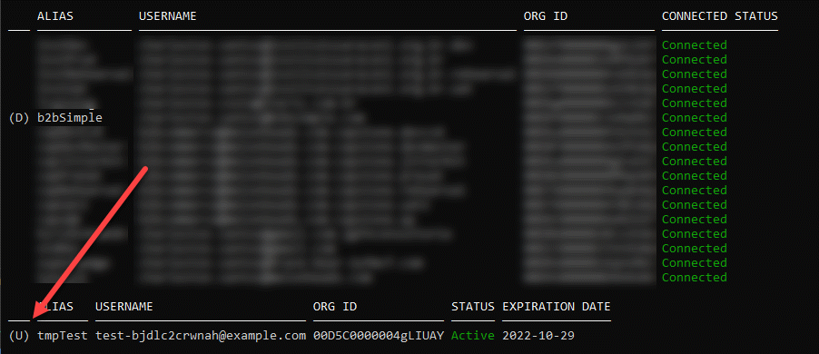

* The "D" sign shows your devHub org;
* The "U" sign shows your *local default organization* (in that one the things will be implemented);

So, with that explained, let's get down to business!

You use the things here in the following ways:
1. [Scratch orgs with devHub already enabled](#scratch-orgs-with-devHub-already-enabled);
1. [Scratch org configuration](#scratch-org-configuration) if you need do that step by step to have that;
1. [Other org types](#other-org-types) do more, get more;


### Scratch orgs with devHub already enabled

If you already are working with scratch orgs and have all configured and defined in your main org (develop, production, etc), you just need to run the command below:

* ./scripts/bash/1-createScratchDigitalExpSetupStore.sh [YOUR_SCRATCH_NAME_HERE] [YOUR_SHOP_NAME_HERE]
* Example:
    ```
    ./scripts/bash/1-createScratchDigitalExpSetupStore.sh tmpD2C storeFront
    ```
    
That will do all the configuration needed to achieve:
* Create the scratch org;
* Create the digital experience;
* Create the store front (with sample products, buyer group, entitlement policy, etc);

## Manual steps

In this current version, we are creating the B2B Commerce in a scratch organization, and uploading [some products to there](scripts/json/Product2s.json).

Nevertheless, that upload doesn't put some pretty images there... for now, to achieve that, we'll perform the manual steps below...

1. Configure the CMS tabs (Setup > Profile > System Administrator)
    * Set as default on CMS Channels, CMS Workspaces, Commerce Setup and Digital Experience

        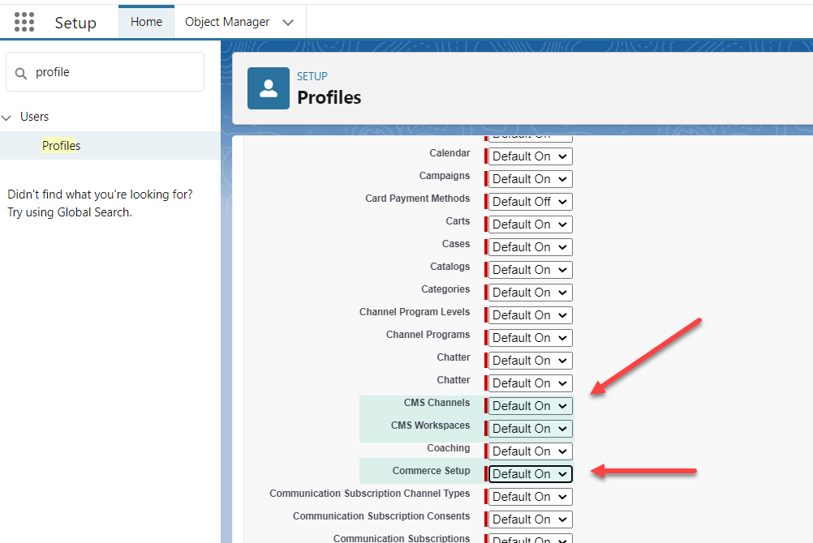
    * If it is not showing as above, probably you'll need deactivate the "Enhanced Profile User Interface" in the "User Management Settings"
1. Create the CMS Workspace (App launcher > CMS Workspaces > Add Workspace)

    To have the scripts really running fine, follow the name convention bellow

    * [YOUR_STORE_NAME] Workspace

        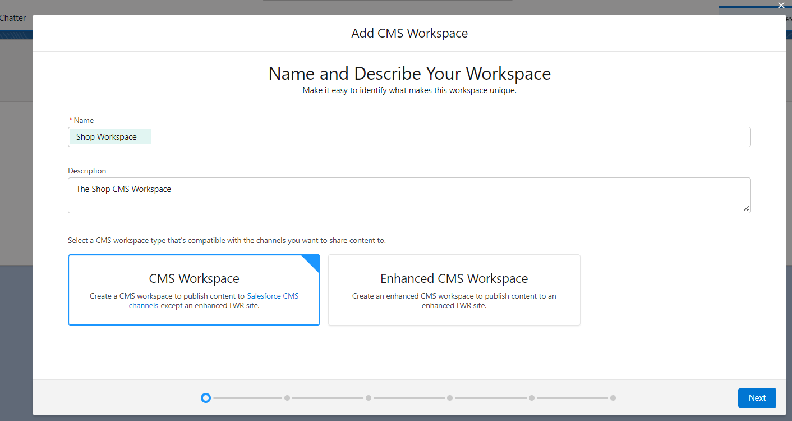
    * Add your store name as a channel
    
        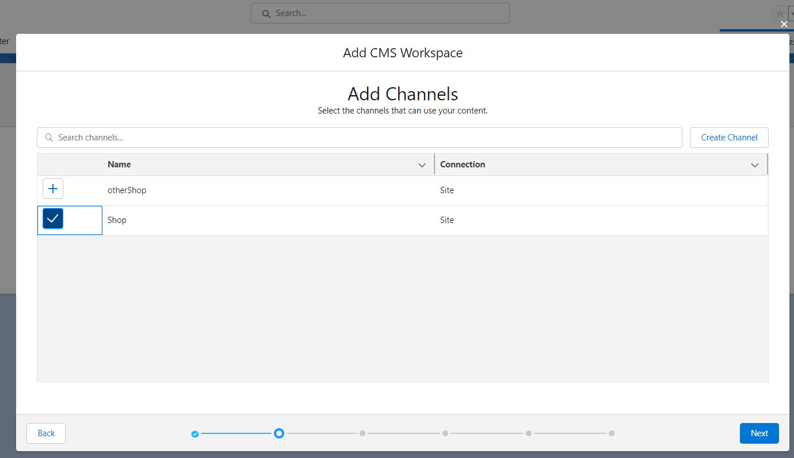
    * Follow the wizard and let it created.

1. Import the media to looks pretty

    Here we'll use [this example file](./scripts/json/productMedia.json.zip) that is [the same extrated here](./scripts/json/productMedia.json).

    * Click on import content
    
        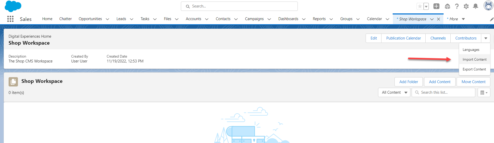
    * Select the file
    
        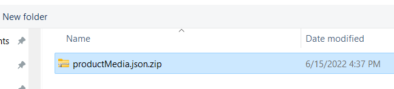
    * Check the "Publish content after import" option and import

        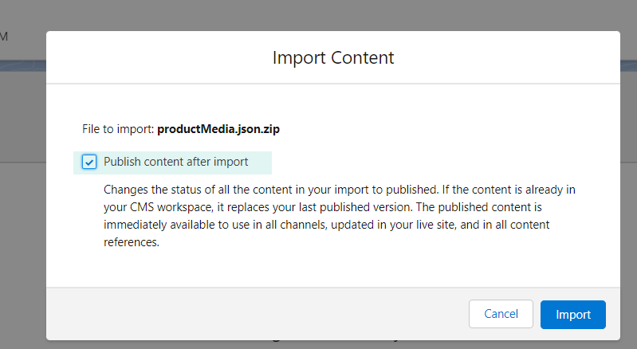

    It will take some seconds... but you'll receive an email when it has finished, then refresh your workspace and check the images there:
        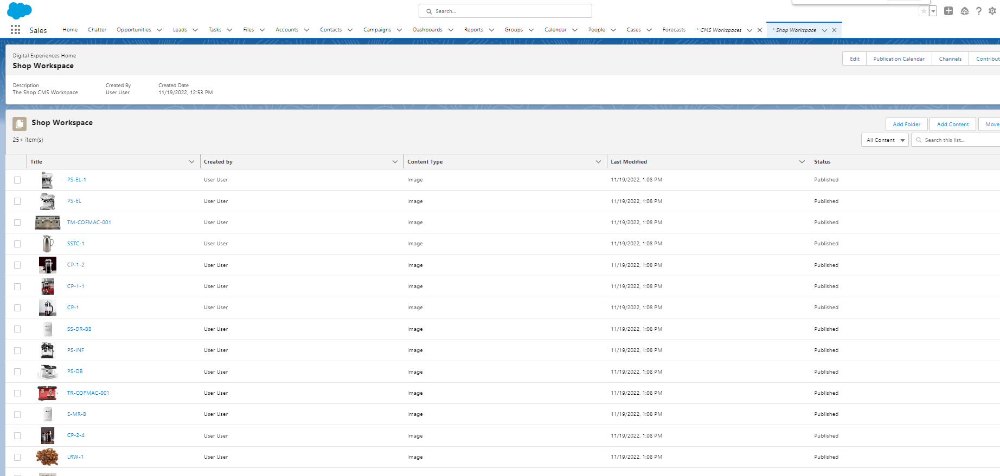

1. With the images and the products there, you'll run the script bellow, to put the things together:
    * ./scripts/bash/6-importProductMedia.sh [YOUR_SHOP_NAME_HERE]
    * Example:
        ```
        ./scripts/bash/6-importProductMedia.sh storeFront
        ```

        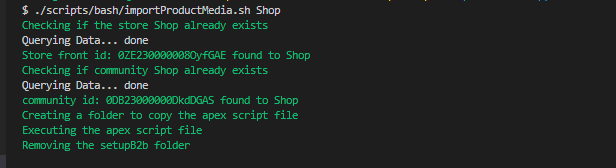

1. Now you can see your produts related with the CMS images:

    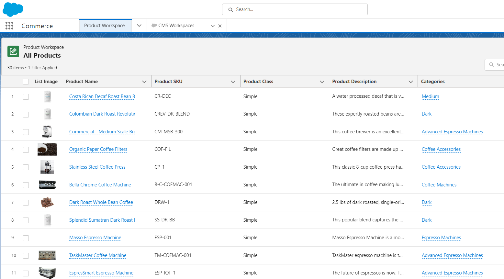

1. Rebuild your search index and check the things working!

    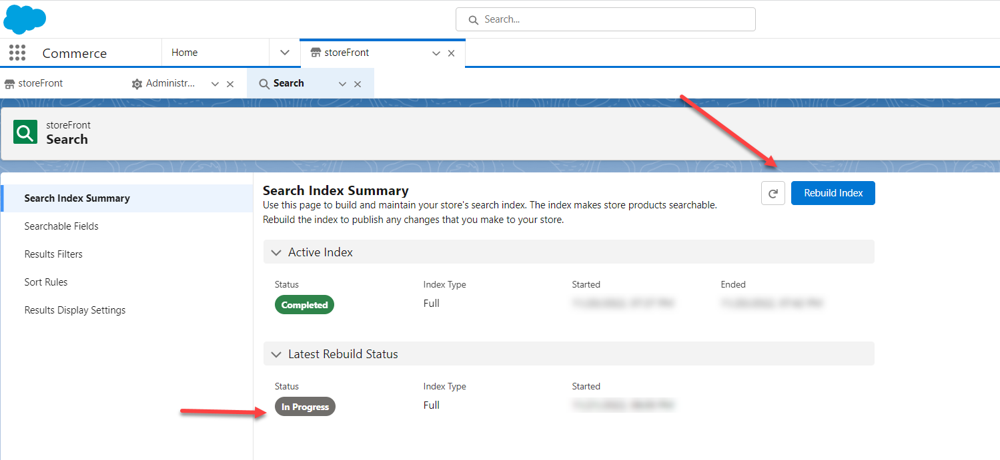

## Out of the Box CSV Importing Products and CMS images

I think that this part, is really, cool!

I mean, out of the box functionalities are always recommended, because those can be done by an administrator!

In this one, we'll use this official salesforce guidance, we are expecting that you take a look there also:
* [The salesforce Import Commerce Data](https://help.salesforce.com/s/articleView?id=sf.comm_data_import.htm&type=5) ;

But if you don't have this time now, don't worry, take a look in the demo, in my youtube channel:

[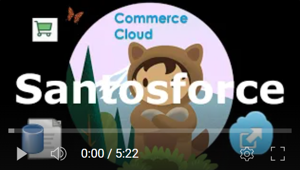](https://youtu.be/pzHeM1pZTsY)


There we have the same contenct in **English**, **Portuguese** and **Spanish**!

Take a look, watch the demo and use our [CSV sample file](scripts/csv/b2bSimpleCommerceImport.csv).


## Scratch org configuration


To work with Scratch orgs, we supposed that, you need to to the steps below:
1. [Enable Dev Hub Features in Your Org](https://help.salesforce.com/s/articleView?id=sf.sfdx_setup_enable_devhub.htm&type=5) (it could be trail, develop or even a productive one).
1. Authorize that Devhub org (please, see the **All Organizations** under "[Authorize the organization](#authorize-the-organization) - Example to authorize set a devhubuser" section);
1. Create your scratch org based on the project file
    * sfdx force:org:create -f config/project-scratch-def.json -a [YOUR_ALIAS_HERE] -d 1
    * That will create the scratch org with a lot of features enable, please take a look on [that project file](config/project-scratch-def.json) to get familiar
    * The "-d" parameter, tells the amount of days that you want your scratch organization last
    * Example:
        ```
        sfdx force:org:create -f config/project-scratch-def.json -a tmpB2C -d 1
        ```
    * Set that as you default organization:
        ```
        sfdx force:config:set defaultusername=tmpB2C
        ```
1. Deploy the things with the script (please see the [Scripting deploying](#All-org-script-deploy) under "Deploying the additional settings" section);
    * ./scripts/bash/2-createDigitalExpSetupStore.sh [YOUR_SCRATCH_NAME_HERE] [YOUR_SHOP_NAME_HERE]
    * Example:
    ```
    ./scripts/bash/2-createDigitalExpSetupStore.sh tmpB2C storeFront
    ```

## Other org types

Well, as I told before, we still working on that... 
Coming soon new updates, stay tuned

## All Organizations

* #### Authorize the organization
    * You can do that pressing the "ctrl + shift + p" keys in VSCode, or;
    * Use the commands below:
        * Example to authorize set a devhubuser:
        * sfdx force:auth:web:login -a [YOUR_ALIAS_HERE] --setdefaultdevhubusername --setdefaultusername 
            ```
            sfdx force:auth:web:login -a b2bSimplesSampe --setdefaultdevhubusername --setdefaultusername 
            ```
        * You also can set the default devhubuser after the authorization, like that:
            ```
            sfdx force:config:set defaultdevhubusername=[YOUR_ALIAS_HERE OR USER_NAME_HERE]
            ```
        * Example to authorize a sandbox org:
            ```
            sfdx auth:web:login -a [YOUR_ALIAS_HERE] -s -r https://test.salesforce.com
            ```        
        * Example to authorize a trial, develop or production org:
            ```
            sfdx auth:web:login -a tmpOrg -s 
            ```        
        * If you do not want to set that org as your default to the project, just suppress the parameter "-s"

* #### Deploying the additional settings
    * This configuration is automatically applied through the **"2-createDigitalExpSetupStore.sh"** script file
    * Some things like Currency, Order, Order management, etc,  needs to be enable with metadata changes, to do that, we have created the [manifest/package-01additionalSettings.xml](manifest/package-01additionalSettings.xml) file.

        Please, feel free to uncomment the necessary setting you may need in your deployment.
    * With the things do you need, you can deploy into you environment with the following commands:
        1. rm -rf Deploy (To clean the deployment folder);
        1. sfdx force:source:convert -r force-app/ -d Deploy -x MANIFEST_FILE.xml (To convert the source in metadata);
        1. sfdx force:mdapi:deploy -d Deploy/ -w -1 (To deploy the things there);
        1. Example
            ```
            rm -rf Deploy
            sfdx force:source:convert -r force-app/ -d Deploy -x manifest/package-01additionalSettings.xml
            sfdx force:mdapi:deploy -d Deploy/ -w -1 
            ```        

